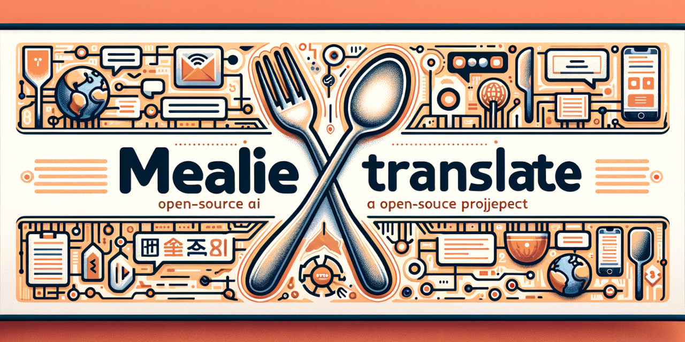
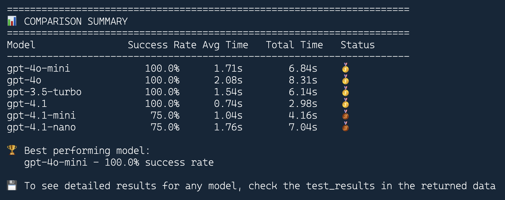

<!-- markdownlint-disable-file MD033 -->
# Mealie Recipe Translator

[](https://github.com/lipkau/mealie_translate/actions/workflows/ci.yml)
[](https://github.com/lipkau/mealie_translate/actions/workflows/cd.yml)
[](https://github.com/lipkau/mealie_translate/actions/workflows/security.yml)
[](https://opensource.org/licenses/MIT)
[](https://www.python.org/downloads/)
[](https://github.com/lipkau/mealie_translate/pkgs/container/mealie_translate)

<p align="center">
  
</p>

A Python application that translates [Mealie](https://mealie.io/) recipes using OpenAI's ChatGPT API and converts
imperial units to metric.

## Features

- **🌍 Recipe Translation**: Translates titles, descriptions, instructions, and ingredients
- **📏 Unit Conversion**: Automatically converts imperial units (cups, pounds, °F) to metric (ml, grams, °C)
- **⚡ Batch Processing**: Efficiently processes multiple recipes
- **🔄 Smart Tracking**: Prevents duplicate processing using recipe extras field
- **🛠️ Error Handling**: Robust retry logic with exponential backoff

## Quick Start with Docker

### Using Docker Run

```bash
# Pull the latest image
docker pull ghcr.io/lipkau/mealie_translate:latest

# Run with environment variables
docker run --rm \
  -e MEALIE_BASE_URL="https://your-mealie-instance.com" \
  -e MEALIE_API_TOKEN="your-mealie-api-token" \
  -e OPENAI_API_KEY="your-openai-api-key" \
  ghcr.io/lipkau/mealie_translate:latest
```

### Using Docker Compose

1. **Create a `docker-compose.yml` file:**

```yaml
version: '3.8'

services:
  mealie-translator:
    image: ghcr.io/lipkau/mealie_translate:latest
    environment:
      - MEALIE_BASE_URL=https://your-mealie-instance.com
      - MEALIE_API_TOKEN=your-mealie-api-token
      - OPENAI_API_KEY=your-openai-api-key
      - CRON_SCHEDULE=0 */6 * * *  # Run every 6 hours
    restart: unless-stopped
```

   > 💡 **Tip**: Copy [`docker-compose.example.yml`](docker-compose.example.yml) for a complete template with all
   > configuration options.

1. **Run the service:**

```bash
docker compose up -d
```

### Configuration

Set these environment variables:

| Variable           | Description                           | Example                         |
| ------------------ | ------------------------------------- | ------------------------------- |
| `MEALIE_BASE_URL`  | Your Mealie server URL                | `https://mealie.yourdomain.com` |
| `MEALIE_API_TOKEN` | Mealie API token                      | `your-api-token-here`           |
| `OPENAI_API_KEY`   | OpenAI API key                        | `sk-...`                        |
| `OPENAI_MODEL`     | OpenAI Model.                         | `gpt-4o-mini`                   |
| `TARGET_LANGUAGE`  | Language to translate to              | `English`                       |
| `PROCESSED_TAG`    | Tag for processed recipes             | `translated`                    |
| `BATCH_SIZE`.      | Nr of recipes to process per batch    | `10`                            |
| `CRON_SCHEDULE`    | Schedule for automatic runs           | `0 */6 * * *` (every 6 hours)   |
| `MAX_RETRIES`      | Retry attempts for failed API calls   | `3`                             |
| `RETRY_DELAY`      | Base delay between retries in seconds | `1`                             |

**Getting API tokens:**

- **Mealie**: Go to Settings → API Tokens in your Mealie instance
- **OpenAI**: Visit [OpenAI API Keys](https://platform.openai.com/api-keys)

## Unit Conversions

The application automatically converts imperial units to metric:

- **Volume**: 1 cup → 240 ml, 1 tablespoon → 15 ml, 1 teaspoon → 5 ml
- **Mass**: 1 pound → 454 g, 1 ounce → 28 g
- **Temperature**: °F → °C using (°F - 32) × 5/9

## Local Development

For contributors and local development:

```bash
git clone https://github.com/lipkau/mealie_translate.git
cd mealie_translate
make setup-full  # Complete development setup
```

👥 **Contributing**: See our [Contributing Guide](.github/CONTRIBUTING.md) for development setup, coding standards,
and contribution workflow.

📚 **Documentation**: Complete guides available in [`docs/`](docs/) including deployment, development, and architecture details.

## OpenAI Model Comparison

<p align="center">
  
</p>

The screenshot above shows a side-by-side comparison of different OpenAI models on real Mealie recipe translation tasks.
This helps users and contributors understand the strengths, weaknesses,
and cost/performance tradeoffs of each model for recipe translation.
For more details, see the documentation or the `tools/` directory for model evaluation scripts.

## How It Works

1. **Fetches recipes** from your Mealie instance
2. **Filters processed** recipes (tracks via extras field)
3. **Translates content** using OpenAI's ChatGPT
4. **Converts units** from imperial to metric
5. **Updates recipes** in Mealie with translated content

## Support

- 🐛 **Bug Reports**: [Create an issue](https://github.com/lipkau/mealie_translate/issues/new?template=bug_report.yml)
- 💡 **Feature Requests**: [Request a feature](https://github.com/lipkau/mealie_translate/issues/new?template=feature_request.yml)
- ❓ **Questions**: [Start a discussion](https://github.com/lipkau/mealie_translate/discussions)

## License

This project is licensed under the MIT License - see the [LICENSE](LICENSE) file for details.
