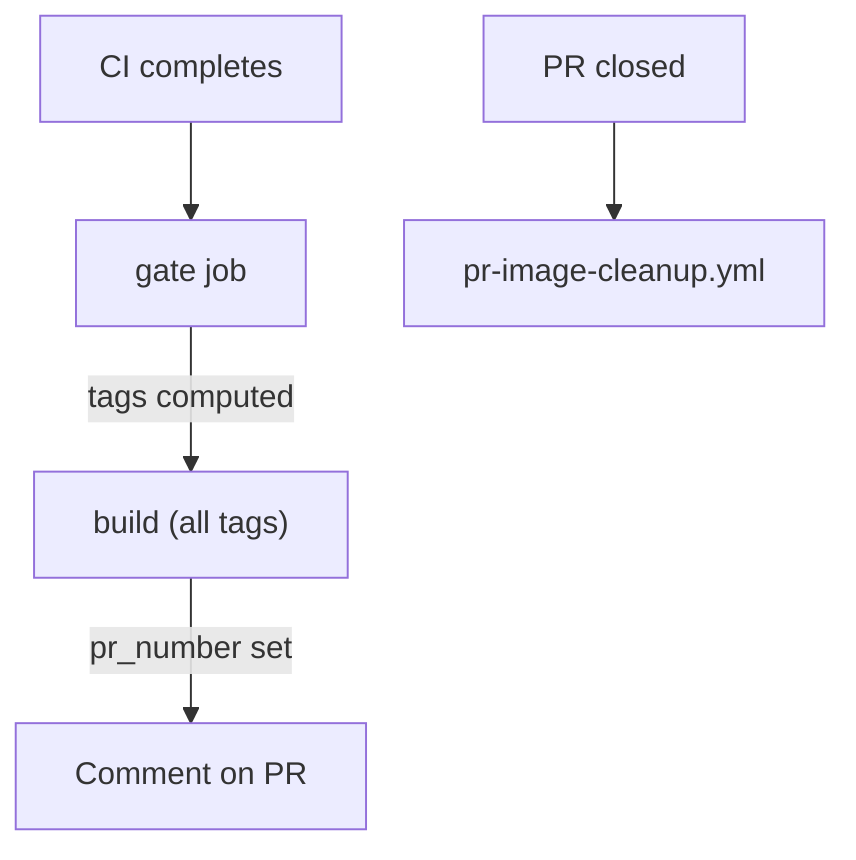

# Docker Image Strategy

This document explains when and how Docker images are built
in the Mealie Recipe Translator project.

## Overview

The CD pipeline builds a single image from the default Dockerfile target
(`runtime`) and applies one or more tags depending on the trigger event.
All published images are identical -- same base, same dependencies,
same entrypoint, same behavior.

The pipeline is defined across two workflow files:

- `cd.yml` -- gate job that computes tags + one build job
- `_docker-build.yml` -- reusable workflow the build job calls

## Image Tags

| Tag       | Built from                       | Purpose                    |
| --------- | -------------------------------- | -------------------------- |
| `dev`     | push to `main` / version tag    | Beta users, staging        |
| `latest`  | version tag on `main`            | Production deployments     |
| `v1.2.3`  | version tag on `main`            | Pinned production version  |
| `pr-<N>`  | every PR (automatic)             | Contributor testing        |

All tags point to the same Dockerfile stage. There is no difference
between a `:dev` image and a `:latest` image other than the tag.

## Build Decision Matrix

| Event                  | `:dev` | `:v*` + `:latest` | `:pr-N` | Total builds |
| ---------------------- | ------ | ------------------ | ------- | ------------ |
| Push to `main`         | yes    | --                 | --      | 1            |
| Version tag on `main`  | yes    | yes                | --      | 1            |
| Pull request           | --     | --                 | yes     | 1            |
| Tag not on `main`      | --     | --                 | --      | 0            |

For version-tag releases, one build produces all three tags
(`:dev`, `:v1.2.3`, `:latest`) from a single image digest.

## Pipeline Architecture



The `gate` job is lightweight (no Docker setup).
It determines which tags to apply and passes them as a single
newline-separated output to the build job.

The build job calls the reusable workflow (`_docker-build.yml`),
which handles checkout, QEMU, buildx, login, build-push,
provenance, SBOM, and optional PR commenting.

## Build Scenarios

### 1. Push to `main` (merge)

```bash
git push origin main
```

**Result**: `:dev` image built (multi-arch).

### 2. Version tag on `main` (release)

```bash
git tag -a v1.2.3 -m "Release v1.2.3"
git push origin v1.2.3
```

**Result** (single build, three tags):

- `ghcr.io/lipkau/mealie_translate:v1.2.3`
- `ghcr.io/lipkau/mealie_translate:latest`
- `ghcr.io/lipkau/mealie_translate:dev`

### 3. Pull request (automatic)

Open or push to a PR targeting `main`.
No manual tagging required.

**Result**:

- `ghcr.io/lipkau/mealie_translate:pr-<N>` (multi-arch)
- Bot comments the `docker pull` command on the PR
- Image is updated on every subsequent push to the PR

### 4. Tag not on `main`

A `v*` tag pushed to a commit that is not on `main` produces no images.
The gate job's `on_main` check rejects it.

## PR Image Lifecycle

1. PR opened or pushed -- CI runs, CD builds `:pr-<N>`, bot comments on the PR.
2. Subsequent pushes -- image is rebuilt, comment is updated (not duplicated).
3. PR closed (merged or not) -- `pr-image-cleanup.yml` deletes the `:pr-<N>`
   package version from GHCR.

## Supply-Chain Attestation

All images are built with:

- **SLSA provenance** (`provenance: mode=max`) -- records builder, source, and
  build instructions.
- **SBOM** (`sbom: true`) -- generates a Software Bill of Materials via Syft.

Inspect with:

```bash
docker buildx imagetools inspect ghcr.io/lipkau/mealie_translate:latest
```

## Cache Strategy

The build job uses the default GHA cache (no scoped partitioning needed
since all builds share the same Dockerfile target).

## Concurrency

The CD workflow uses a concurrency group keyed on the triggering branch:

```yaml
concurrency:
  group: cd-${{ github.event.workflow_run.head_branch }}
  cancel-in-progress: true
```

Rapid pushes to the same branch cancel in-flight CD runs.
Different version tags each get their own group and never cancel each other.

## Troubleshooting

### Image not built

1. Check that CI completed successfully (CD only runs on CI success).
2. For versioned releases, verify the tag follows the `v*` pattern and the
   tagged commit is on `main`.
3. Check the `gate` job logs for the `Decide build tags` step output.

### PR image not appearing

1. Confirm CI passed for the PR.
2. Check the `gate` job's `Find associated pull request` step -- the PR must
   be open at the time CD runs.

## Related Documentation

- [CI/CD Architecture](CI_CD_ARCHITECTURE.md) -- full pipeline overview
- [Docker Guide](DOCKER.md) -- container usage and deployment
- [Development Guide](DEVELOPMENT.md) -- local development setup
