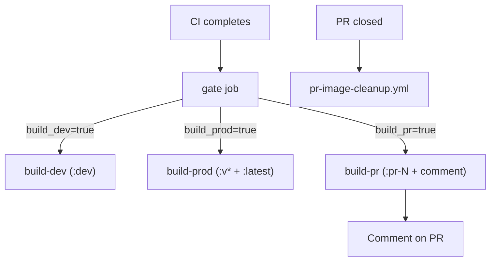

# Docker Image Strategy

This document explains when and how different Docker images are built
in the Mealie Recipe Translator project.

## Overview

The CD pipeline produces three categories of Docker images:

- **Development images** (`target: development`) -- for PR testing and the `:dev` tag
- **Production images** (`target: production`) -- for versioned releases and `:latest`

The pipeline is defined across two workflow files:

- `cd.yml` -- gate job + three caller jobs
- `_docker-build.yml` -- reusable workflow that all build jobs share

## Image Tags

| Tag       | Built from                       | Dockerfile target | Purpose                    |
| --------- | -------------------------------- | ----------------- | -------------------------- |
| `dev`     | push to `main` / version tag    | development       | Beta users, staging        |
| `latest`  | version tag on `main`            | production        | Production deployments     |
| `v1.2.3`  | version tag on `main`            | production        | Pinned production version  |
| `pr-<N>`  | every PR (automatic)             | development       | Contributor testing        |

## Build Decision Matrix

| Event                  | `:dev` | `:v*` + `:latest` | `:pr-N` | Total builds |
| ---------------------- | ------ | ------------------ | ------- | ------------ |
| Push to `main`         | yes    | --                 | --      | 1            |
| Version tag on `main`  | yes    | yes                | --      | 2 (parallel) |
| Pull request           | --     | --                 | yes     | 1            |
| Tag not on `main`      | --     | --                 | --      | 0            |

## Pipeline Architecture



The `gate` job is lightweight (no Docker setup).
It determines which downstream build jobs to run and passes outputs
(tag name, PR number) to them.

All three build jobs call the same reusable workflow
(`_docker-build.yml`), which handles checkout, QEMU, buildx, login,
build-push, provenance, SBOM, and optional PR commenting.

For version-tag releases, `build-dev` and `build-prod` run
**in parallel** on separate runners.

## Build Scenarios

### 1. Push to `main` (merge)

```bash
git push origin main
```

**Result**: `:dev` image built (development target, multi-arch).

### 2. Version tag on `main` (release)

```bash
git tag -a v1.2.3 -m "Release v1.2.3"
git push origin v1.2.3
```

**Result** (parallel):

- `ghcr.io/lipkau/mealie_translate:v1.2.3` + `:latest` (production target)
- `ghcr.io/lipkau/mealie_translate:dev` (development target)

### 3. Pull request (automatic)

Open or push to a PR targeting `main`.
No manual tagging required.

**Result**:

- `ghcr.io/lipkau/mealie_translate:pr-<N>` (development target, multi-arch)
- Bot comments the `docker pull` command on the PR
- Image is updated on every subsequent push to the PR

### 4. Tag not on `main`

A `v*` tag pushed to a commit that is not on `main` produces no images.
The gate job's `on_main` check rejects it.

## PR Image Lifecycle

1. PR opened or pushed -- CI runs, CD builds `:pr-<N>`, bot comments on the PR.
2. Subsequent pushes -- image is rebuilt, comment is updated (not duplicated).
3. PR closed (merged or not) -- `pr-image-cleanup.yml` deletes the `:pr-<N>`
   package version from GHCR.

## Supply-Chain Attestation

All images are built with:

- **SLSA provenance** (`provenance: mode=max`) -- records builder, source, and
  build instructions.
- **SBOM** (`sbom: true`) -- generates a Software Bill of Materials via Syft.

Inspect with:

```bash
docker buildx imagetools inspect ghcr.io/lipkau/mealie_translate:latest
```

## Cache Strategy

Each build job uses a separate GHA cache scope to prevent eviction across targets:

| Job          | Scope  |
| ------------ | ------ |
| `build-dev`  | `dev`  |
| `build-prod` | `prod` |
| `build-pr`   | `pr`   |

## Concurrency

The CD workflow uses a concurrency group keyed on the triggering branch:

```yaml
concurrency:
  group: cd-${{ github.event.workflow_run.head_branch }}
  cancel-in-progress: true
```

Rapid pushes to the same branch cancel in-flight CD runs.
Different version tags each get their own group and never cancel each other.

## Troubleshooting

### Image not built

1. Check that CI completed successfully (CD only runs on CI success).
2. For production images, verify the tag follows the `v*` pattern and the
   tagged commit is on `main`.
3. Check the `gate` job logs for the `Decide build targets` step output.

### PR image not appearing

1. Confirm CI passed for the PR.
2. Check the `gate` job's `Find associated pull request` step -- the PR must
   be open at the time CD runs.

### Wrong image type

Production images use the `production` Dockerfile target.
Development and PR images use the `development` target.
If the image has dev dependencies, it was built from the `development` target.

## Related Documentation

- [CI/CD Architecture](CI_CD_ARCHITECTURE.md) -- full pipeline overview
- [Docker Guide](DOCKER.md) -- container usage and deployment
- [Development Guide](DEVELOPMENT.md) -- local development setup
