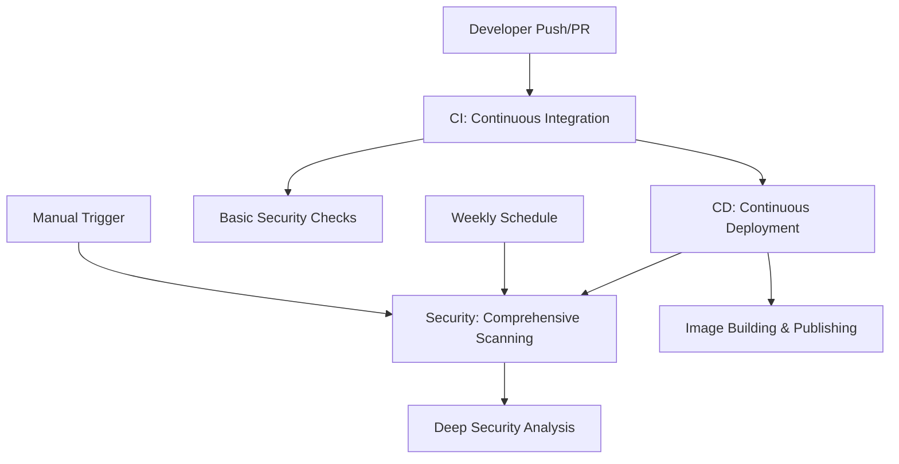

# Security Architecture

This document describes the multi-layered security scanning architecture implemented in this repository.

## Overview

Our security scanning is implemented across three distinct workflows, each with a specific purpose:



## 1. CI Pipeline Security (Basic & Fast)

**File**: `.github/workflows/ci.yml`
**Triggers**: All pushes and pull requests
**Purpose**: Early security feedback during development

### What it scans

- ✅ **Python code security** with `bandit`
- ✅ **Dependency vulnerabilities** with `pip-audit`
- ✅ **Code quality** with linting and formatting

### Why in CI

- **Fast feedback** for developers
- **Prevents** obviously insecure code from being merged
- **Lightweight** scanning that doesn't slow down development

```bash
# Local equivalent
make security-scan
```

## 2. CD Pipeline (Image Building)

**File**: `.github/workflows/cd.yml`
**Triggers**: Main branch pushes, tags, successful CI
**Purpose**: Build and publish container images

### What it does

- 🏗️ **Builds** Docker images (development & production)
- 📦 **Publishes** to GitHub Container Registry
- 🚀 **Deploys** to staging/production environments

### Security considerations

- Uses **multi-stage** Docker builds for minimal attack surface
- **Signs** container images (future enhancement)
- **Minimal** base images

## 3. Security Pipeline (Comprehensive & Deep)

**File**: `.github/workflows/security.yml`
**Triggers**: After successful CD, weekly schedule, manual
**Purpose**: Comprehensive security analysis of published artifacts

### What it scans

#### Python Security Analysis

- 🔍 **Static code analysis** with bandit (JSON reports)
- 🛡️ **Dependency vulnerabilities** with pip-audit
- 📊 **Security metrics** and trending

#### Docker Image Security

- 🐳 **Container vulnerabilities** with Trivy
- 🔍 **Base image** security analysis
- 📋 **SARIF reports** to GitHub Security tab
- 📊 **Multiple output formats** (SARIF, JSON, table)
- 🎯 **Multiple image tags** (latest, dev)
- 📈 **Vulnerability severity breakdown** in workflow summaries

#### Reporting

- 📄 **SARIF uploads** to GitHub Security tab
- 📊 **Detailed artifacts** for investigation
- 💬 **Commit comments** with security status
- 📈 **Trend analysis** (future enhancement)

## Trigger Strategy

### Automatic Triggers

1. **Every code change** → CI security scan (basic)
2. **After successful CD** → Comprehensive security scan
3. **Weekly schedule** → Full security audit (Monday 2 AM UTC)

### Manual Triggers

```bash
# Via GitHub UI or CLI
gh workflow run security.yml --field image_tag=v1.2.3
```

## Security Reports

### GitHub Security Tab

- **Vulnerability alerts** from Trivy SARIF uploads
- **Dependency insights** from pip-audit scans
- **Security advisories** integration

### Workflow Artifacts

- `python-security-reports/` - Bandit and pip-audit results
- `docker-security-reports-*/` - Trivy analysis per image tag

### Notifications

- **Commit comments** on main branch after CD
- **Workflow summary** with security status
- **Email notifications** for failed scans (configurable)

## Configuration

### Environment Variables

```yaml
env:
  REGISTRY: ghcr.io
  IMAGE_NAME: ${{ github.repository }}
```

### Scheduled Scanning

```yaml
schedule:
  - cron: "0 2 * * 1" # Every Monday at 2 AM UTC
```

### Manual Scanning

```yaml
workflow_dispatch:
  inputs:
    image_tag:
      description: "Docker image tag to scan"
      default: "latest"
```

## Best Practices Implemented

### 🔄 **Separation of Concerns**

- **CI**: Fast development feedback
- **CD**: Reliable deployments
- **Security**: Deep analysis without blocking

### ⚡ **Performance Optimization**

- **Parallel execution** of security jobs
- **Cached dependencies** for faster scans
- **Matrix strategy** for multiple image scanning

### 🛡️ **Defense in Depth**

- **Multiple scan types** (static, dynamic, dependency)
- **Multiple tools** (bandit, pip-audit, trivy)
- **Multiple trigger points** (CI, CD, scheduled)

### 📊 **Comprehensive Reporting**

- **GitHub Security integration**
- **Artifact preservation**
- **Status notifications**

## Local Development

Developers can run the same security scans locally:

```bash
# Run all security scans
make security-scan

# Individual scans
make security-bandit    # Python code analysis
make security-pip-audit # Dependency vulnerabilities
```

## Future Enhancements

### 🔮 **Planned Features**

- [ ] **Container signing** with cosign
- [ ] **SBOM generation** for supply chain security
- [ ] **Security trend analysis** and metrics
- [ ] **Integration** with external security platforms
- [ ] **Custom security policies** and rules
- [ ] **Automated remediation** suggestions

### 🎯 **Advanced Scanning**

- [ ] **Dynamic application security testing** (DAST)
- [ ] **Infrastructure as Code** security scanning
- [ ] **Secret scanning** enhancement
- [ ] **License compliance** checking

## Troubleshooting

### Common Issues

**Q: Security scan fails after successful CD**
A: Check if the Docker image was actually published to the registry

**Q: Trivy can't access the image**
A: Verify registry permissions and image tags

**Q: Weekly scans not running**
A: Check that the repository has activity; GitHub may disable scheduled workflows

### Debugging Commands

```bash
# Check if images exist
docker pull ghcr.io/$REPO:latest

# Local Trivy scan
trivy image ghcr.io/$REPO:latest

# Local bandit scan
bandit -r mealie_translate/
```

## Tool Migration History

### Migration from Safety to pip-audit

**Date**: August 2025
**Reason**: Safety became a paid service, requiring migration to an open-source alternative

### Migration to Ruff

**Date**: August 2025
**Reason**: Improved performance and developer experience

#### Tool Replacement Changes

**Tool Replacement**:

- Replaced `black`, `flake8`, and `isort` with `ruff`
- Updated `pyproject.toml` configuration
- Updated Makefile commands
- Updated pre-commit hooks
- Updated documentation references

**Benefits**:

- **Performance**: 10-100x faster than replaced tools
- **Unified Tooling**: Single tool replaces three separate ones
- **Better Error Messages**: More descriptive and actionable
- **Modern Architecture**: Written in Rust for speed and reliability

### Migration to Pyright

**Date**: August 2025
**Reason**: Better VS Code integration and performance

#### Tool Replacement Details

**Tool Replacement**:

- Replaced `mypy` with `pyright`
- Created `pyrightconfig.json` configuration
- Updated Makefile commands
- Updated VS Code extension recommendations
- Updated documentation references

**Benefits**:

- **VS Code Integration**: Native integration with Pylance
- **Performance**: Faster type checking than mypy
- **Better Error Messages**: More actionable diagnostics
- **Modern Architecture**: Written in TypeScript/Node.js, actively maintained by Microsoft

#### Changes Made

**Core Files Updated**:

- `pyproject.toml` - Replaced `safety>=2.3.0` with `pip-audit>=2.6.0`
- `Makefile` - Added `security-pip-audit` target, updated `security-scan`

**CI/CD Workflows Updated**:

- `.github/workflows/ci.yml` - Removed Trivy installation, using make commands
- `.github/workflows/security.yml` - Replaced Trivy filesystem scanning with pip-audit

**Documentation Updated**:

- Updated tool references across security documentation
- Updated artifact names and descriptions

**Security-Conscious Setup Process**:

- Split setup into `setup` (basic) and `setup-full` (with optional hooks)
- Enhanced `pre-commit` target with detailed warnings about git repository modification
- Added `pre-commit-uninstall` target for easy removal of git hooks
- Clear distinction between pip package installation vs. git hook installation
- Enhanced transparency about persistence and removal options

**Cleanup of Legacy Files**:

- Removed `requirements-frozen.txt` (was created for Trivy filesystem scanning)
- Removed `.trivyignore` (only needed for filesystem scanning, not Docker image scanning)

#### Why pip-audit?

- ✅ **Open source** - No licensing fees
- ✅ **PyPI integration** - Direct access to vulnerability database
- ✅ **Active maintenance** - Maintained by Python Packaging Authority
- ✅ **JSON output** - Structured reporting for CI/CD
- ✅ **Better Python support** - Designed specifically for Python packages

#### Tool Comparison Results

**Safety (before)**:

- Required paid license for continued updates
- Less frequent vulnerability database updates
- Focused on Python packages

**pip-audit (current)**:

- Free and open source
- Direct PyPI vulnerability database access
- Better integration with Python packaging ecosystem
- Faster and more accurate scanning

## Security Contact

For security vulnerabilities, please follow our [Security Policy](../.github/SECURITY.md).

## Recent Security Improvements

### CodeQL False Positive Reduction

**Problem**: GitHub's default CodeQL analysis was generating 1200+ security alerts, mostly false positives.

**Solution**: Implemented custom CodeQL configuration with intelligent filtering:

**Architectural Decision**: Instead of creating a separate CodeQL workflow, CodeQL analysis was integrated into the
existing `security.yml` workflow to maintain the clean separation of concerns (CI → CD → Security) and avoid
workflow sprawl.

**Files Added**:

- `.github/codeql/codeql-config.yml` - CodeQL configuration with exclusions
- `.github/scripts/filter_sarif.py` - SARIF results filter
- `.github/security.yml` - Disables default GitHub scanning

**Files Modified**:

- `.github/workflows/security.yml` - Added CodeQL analysis to existing security workflow

**Key Improvements**:

1. **Targeted Scanning**: Only scan actual application code (`mealie_translate/`, `main.py`)
2. **Excluded Paths**: Skip tests, docs, configs, build artifacts
3. **Reduced Rule Set**: Use `security-and-quality` instead of `security-extended`
4. **False Positive Filtering**: Exclude rules irrelevant to our simple API application:
   - SQL injection (we don't use databases)
   - XSS/CSRF (we don't serve web content)
   - Path traversal (we don't handle file uploads)
   - Regex injection (our patterns are static)

**Result**: Dramatically reduced false positives while maintaining real security coverage.

**Local Testing**:

```bash
# Test current security scanning
make security-scan

# Results should show minimal/no vulnerabilities
# bandit: Static Python security analysis
# pip-audit: Dependency vulnerability scanning
```

This approach ensures that security alerts are meaningful and actionable, rather than overwhelming with false positives.
